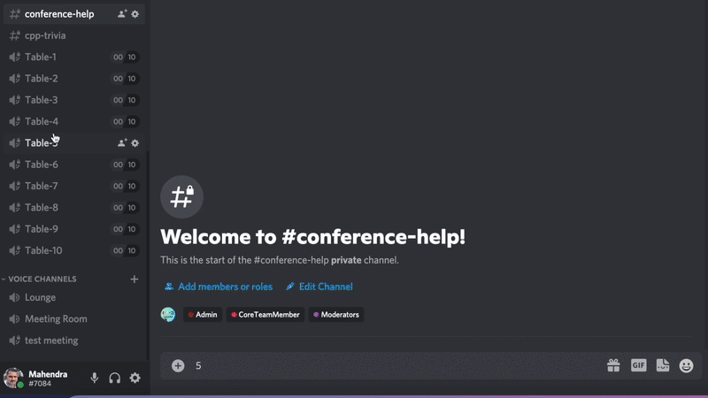

## Platform

[Discord](https://discord.gg/Wz42tX5){:target="_blank"} is our networking platform for CppIndiaCon 2021. Please join the server in advance and familirize yourself.

During this conference, you will see several text channels and voice/video/screen sharing tables.

## What's on networking table?
Get in touch with other community members and share thoughts.

### How to join and switch tables?

### How to share screen?

### How to chat in discord voice channel?

## What’s in [#welcome-rules-and-coc](https://discord.gg/jwN7ZrcN){:target="_blank"}?
This is an important channel. It is highly recommended to read the rules pinned in this channel.

## What's in [#announcement](https://discord.gg/83UxvueZ){:target="_blank"}?
This is readonly channel. CppIndia will make announcments here throughout the day. Keep watching this channel.

## What’s in [#conference-help](https://discord.gg/4DqN468N){:target="_blank"}?
You can ask any queries or doubts related to any of the talks or sessions from the Conference.
Have a question for the speaker, or got a problem? Message here, we will try to resolve it asap.

## What’s in [#code-of-conduct](https://discord.gg/PrN7gwaa){:target="_blank"}?
If you see any happening in the conference which do not follow our code of conduct, please report in this channel.

## What’s in [#cpp-discussion](https://discord.gg/T2y7Hypb)?
You can discuss any C++ related topic here.

## What’s in [#contest-cpp-trivia](https://discord.gg/q2C4JXrE){:target="_blank"}?
There will be a C++ trivia contest will be running throughout the day. We will be posting questions(puzzles, MCQ, design questions, etc.), for discussion. Anyone can share their opinions or what they understand on that topic. At the end of the day, winners will be announced.

## What's in [#contest-social-media](https://discord.gg/eVzGTReQ){:target="_blank"}?
A socia media contest will be going on throughout the day. For rules and guidlines, please check pinned post in the channel.  At the end of the day, winners will be announced.

## What's in [#show-and-tell](https://discord.gg/P2qJDhfp){:target="_blank"}?
Use the channel to show case any of your project, work, YouTube channel, Podcast etc. Self-Promotions.

## What's in [#recently-i-learned](https://discord.gg/34kfRgjD){:target="_blank"}?
Let the whole community know, what you learnt recently?

## What's in [#find-a-buddy](https://discord.gg/sesZvt9u){:target="_blank"}?
Looking for some partner to work on some project? Finding a mentor? want to hangout? Facing some issue, need some help? This is the place to let community know about your requirement(s).

## What's in [#performance-optimization-techniques](https://discord.gg/6yweq8St){:target="_blank"}?
Discuss the performance optimization in the C++ project. Share your knowledge and the techniques you use.

## What are sponsor's channels?
- [#Undo(Gold Sponsor)](https://discord.gg/NazszebB){:target="_blank"}: Join to know more about Undo and their projects.
- [#CircuitSutra(Gold Sponsor)](https://discord.gg/pEZHkVsU){:target="_blank"}: Join to know more about CircuitSutra and their projects.

## What are [Talk] voice channels?
There are 5 voice channels related to talks, where our speakers will be present for a while post their talks. You can grab this chance to intract with them.
- [#Talk: Customization Methods](https://discord.gg/4TQCGkPZ){:target="_blank"}
- [#Talk: Default Generated Comparison for Your Data Types](https://discord.gg/7yggFeJh){:target="_blank"}
- [#Talk: Concurrency with Reactor Pattern](https://discord.gg/uEPYfASh){:target="_blank"}
- [#Talk: Getting the most out of GDB](https://discord.gg/fQQuPmhq){:target="_blank"}
- [#Talk: How C++ eliminated Memory Issues](https://discord.gg/Kusr4CbH){:target="_blank"}

## What are [Tables] voice channels?
There are few open voice tables for networking. Use these to intract with other members. This is one of the best part of any conference. Don't miss to grab this opportunity.

## What’s in [#compile_my_code](https://discord.gg/uMerXfZhSP){:target="_blank"}?
Use this channel to test and compile your code.
Read [this link](https://headlinedev.xyz/discord-compiler/tutorial.html){:target="_blank"} to know how to use compiler bot.

## What’s in the [#new-member-introduction](https://discord.gg/tK2p9u8KFv){:target="_blank"}? 
Let us all know about what a great personality you have! Maybe you can find people with similar interests here, or can make new connections.
Please introduce yourself, we love getting to know new people. 

Here’s a basic template what you can use to tell us about yourself: 
-  Your location. 
-  What are you currently doing (Working Professional/Student/Other)
-  Your hobbies/interests.
-  Profile or portfolio links.

